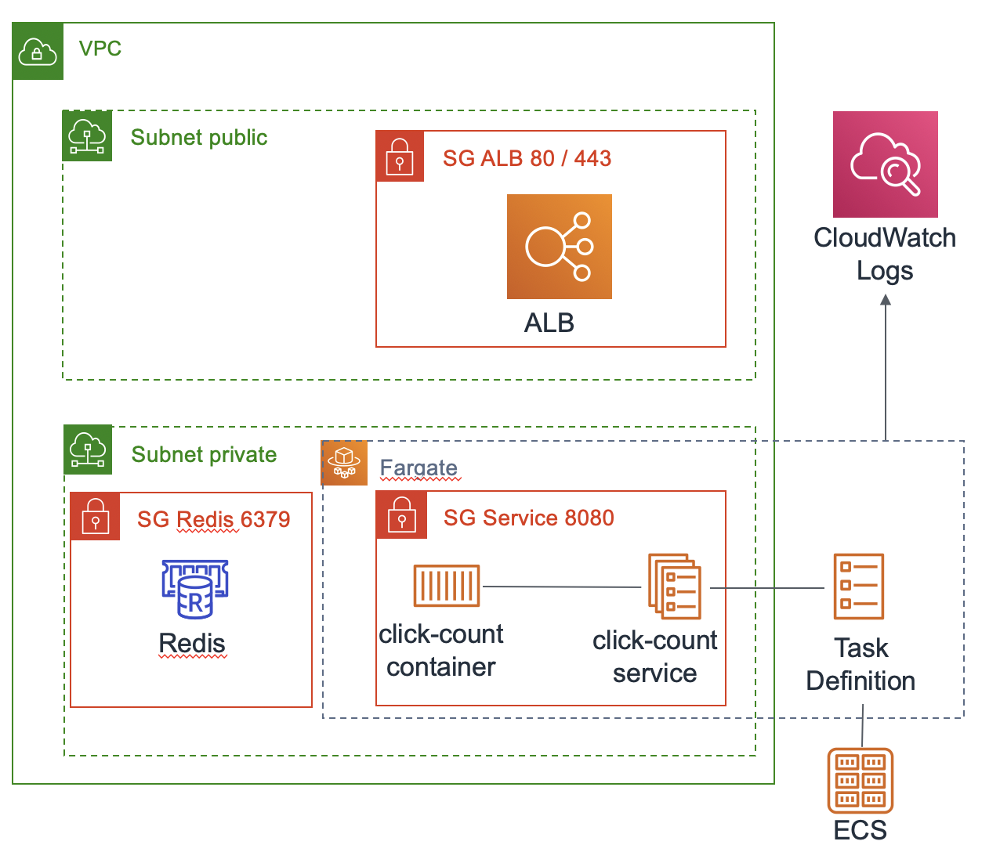

# xke-aws

[Documentation de sceptre](https://sceptre.cloudreach.com/latest/docs/get_started.html)
```
pip install sceptre
sceptre --version
```

# Exercice 2 - Exo DEVOPS



Pour implémenter ce schéma nous allons créer 3 stacks cloudformation :
 * Elasticache Redis
 * Cluster ECS et le loadbalancer
 * Fargate click-count

## Build docker en local
La première chose à faire est de builder une image docker du click-count pour en suite la push dans le registry
```bash
cd click-count
docker build -t click-count .
```

## Push l'image docker sur ECR
**Création du registry ECR**
```bash
cd cloudformation
AWS_PROFILE=<profile> sceptre launch -y exo2-devops/docker-registry.yaml
```

**Push de l'image dans ce registry**  
Les instructions pour pusher l'image sont présentes [sur la page ECR](https://eu-west-1.console.aws.amazon.com/ecr/repositories/click-count/?region=eu-west-1)


## Création du Redis
Le template Cloudformation est quasiment fini, il reste à créer le security group de Redis et à le retourner en Output.  
Ce security group doit être vide, c'est à dire pas d'ingress ni d'egress.
 
```bash
AWS_PROFILE=<profile> sceptre launch -y exo2-devops/redis.yaml
```


## Création du cluster ECS et de son loadbalancer

**Explications**
 * Un application load balancer dans les subnets publics avec comme scheme *internet-facing*
 * Un security group sur ce load balancer qui autorise 0.0.0.0/0 sur les port 80 et 443
 * Un cluster ECS pour faire tourner les conteneurs docker
 * Un listener doit obligatoirement pointer vers une TargetGroup d'où la "ALBDefaultTargetGroup" à mettre en "DefaultActions" du listener
 * [Optionnel] Un record route 53 de type Alias est crée pour l'url du load balancer

**Les ressources à créer**
 * AWS::ECS::Cluster
 * AWS::EC2::SecurityGroup
 * AWS::ElasticLoadBalancingV2::LoadBalancer
 * AWS::ElasticLoadBalancingV2::TargetGroup
 * AWS::ElasticLoadBalancingV2::Listener

```bash
AWS_PROFILE=<profile> sceptre launch -y exo2-devops/ecs-cluster.yaml
```
 
## Création du service click-count

**Explications**
 * Un log group pour déverser les logs docker dans CloudWatch Logs
 * Une TaskDefinition pour configurer le conteneur (port, mémoire, image, ...)
 * Le conteneur docker *ecs-tasks.amazonaws.com* assume un rôle lui permettant d'intéragir avec les services AWS. Ici seule la managed policy *arn:aws:iam::aws:policy/service-role/AmazonECSTaskExecutionRolePolicy* est nécessaire sur ce rôle
 * Le listener est configuré pour forwarder tout le trafic "/*" sur la TargetGroup
 * La Target Group a un healthcheck /rest/healthcheck 
 * Le service a un security group qui n'autorise les connexions sur le port 8080 que depuis le load balancer
 * La stack ajouter un Ingress au security group de redis pour que les connexions du conteneurs vers Redis soient possibles
 
**Les ressources à créer**
 * AWS::Logs::LogGroup
 * AWS::ECS::TaskDefinition
 * AWS::IAM::Role
 * AWS::ElasticLoadBalancingV2::ListenerRule
 * AWS::ECS::Service
 * AWS::EC2::SecurityGroup
 * AWS::EC2::SecurityGroupIngress
 

```bash
AWS_PROFILE=<profile> sceptre launch -y exo2-devops/ecs-click-count.yaml
```

## Bonus
### Stack ECS / ALB
 * Activer les access logs sur S3 via l'attribut "LoadBalancerAttributes" de la ressource "AWS::ElasticLoadBalancingV2::LoadBalancer"
 * Rajouter un listener HTTPS avec un certificat ACM
 * Enregistrer un record *AWS::Route53::RecordSet* pour le loadbalancer 
