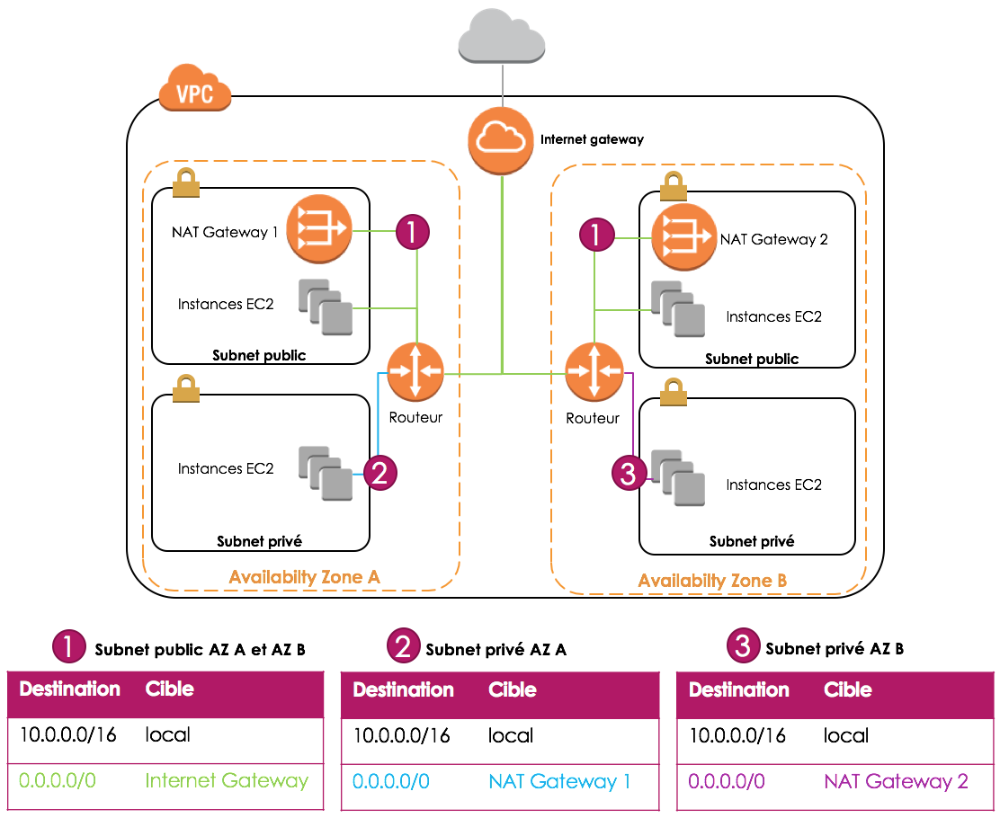

# xke-aws

[Documentation de sceptre](https://sceptre.cloudreach.com/latest/docs/get_started.html)
```
pip install sceptre
sceptre --version
```


# Exercice 1 - VPC
## Lancer la stack VPC
```bash
cd cloudformation
AWS_PROFILE=<profile> sceptre launch -y network/vpc.yaml
```

## Implémenter le VPC suivant


**Explications**
* Un VPC réparti sur deux AZ : CIDR 192.168.1.0/24
* Un subnet public et un subnet privé dans chaque AZ
    * Public 1 : 192.168.1.0/26
    * Public 2 : 192.168.1.64/26
    * Private 1 : 192.168.1.128/26 
    * Private 2 : 192.168.1.192/26
* Une seule NAT Gateway dans un des subnets public
* La route "0.0.0.0/0" des subnets privés pointent vers la NAT Gateway
* La route "0.0.0.0/0" des subnets publics pointent vers l'Internet Gateway
* Une hosted zone route 53 privée pour héberger les records DNS interne
* Des VPC endpoints (Gateway VPC Endpoints) pour Dynamodb et S3 dans les routes  

**Les ressources à créer**
* AWS::EC2::VPC
* AWS::EC2::InternetGateway
* AWS::EC2::VPCGatewayAttachment
* AWS::EC2::Subnet
* AWS::EC2::SubnetNetworkAclAssociation
* AWS::EC2::NetworkAclEntry
* AWS::EC2::EIP
* AWS::EC2::NatGateway
* AWS::EC2::Route
* AWS::EC2::SubnetRouteTableAssociation
* AWS::EC2::VPCEndpoint

**Les ressources optionnelles**
* AWS::Route53::HostedZone 
* AWS::EC2::NetworkAcl
