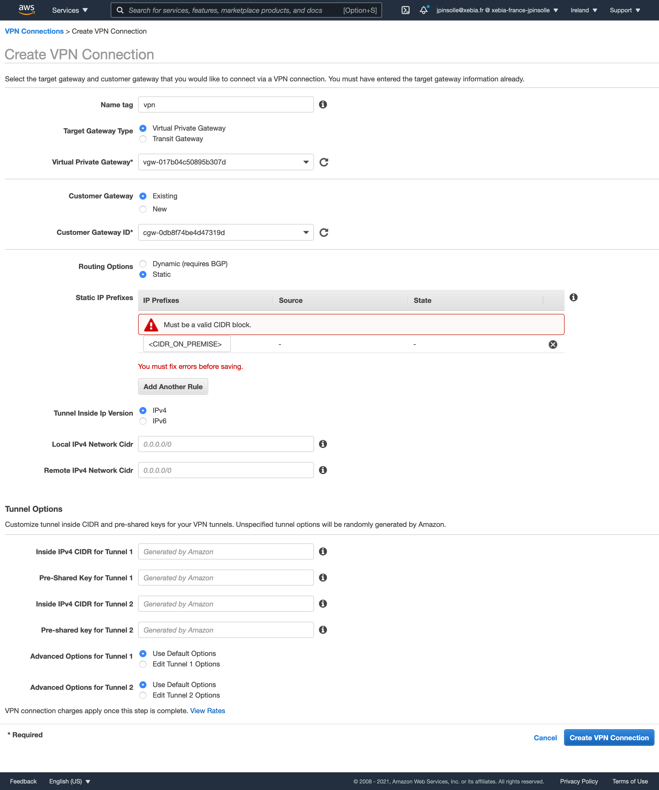

# VPN Site-to-Site

[Documentation de sceptre](https://sceptre.cloudreach.com/latest/docs/get_started.html)

```
pip install sceptre
sceptre --version
```


# Exercice - VPN


## VPC
Démonstration inspiré de ce contenu  
https://www.youtube.com/watch?v=5YvcyBecQts  
https://awstrainingcenter-test.s3-us-west-2.amazonaws.com/AWS-Setup-Site-to-Site-VPN-Connection.pdf

### Créer le VPC dans la région eu-west-1
```bash
cd cloudformation
AWS_PROFILE=$PROFILE sceptre --var-file="variables.yaml" launch --yes eu-west-1/vpc.yaml
```

### Créer le VPC dans la région eu-west-3
```bash
cd cloudformation
AWS_PROFILE=$PROFILE sceptre --var-file="variables.yaml" launch --yes eu-west-3/vpc.yaml
```
## Les instances EC2
### Openswan
Créer une instance ec2 dans le subnet public (eu-west-3) et lui mettre ce security-group


```bash
# Installer openswan
yum install -y openswan

$ cat /etc/sysctl.conf
net.ipv4.ip_forward = 1
net.ipv4.conf.all.accept_redirects = 0
net.ipv4.conf.all.send_redirects = 0

# Relancer le service réseau
service network restart
cat /proc/sys/net/ipv4/conf/eth0/forwarding
```

```bash
$ cat /etc/ipsec.d/aws.conf

conn Tunnel1
        authby=secret
        auto=start
        left=%defaultroute
        leftid=<IP_PUBLIC_OPENSWAN>
        right=<IP_TUNNEL1_AWS_VPN_GATEWAY>
        type=tunnel
        ikelifetime=8h
        keylife=1h
        phase2alg=aes128-sha1;modp1024
        ike=aes128-sha1;modp1024
        keyingtries=%forever
        keyexchange=ike
        leftsubnet=<VPC_CIDR_ON_PREMISE>
        rightsubnet=<VPC_CIDR_AWS>
        dpddelay=10
        dpdtimeout=30
        dpdaction=restart_by_peer
```

Le contenu est récupéré en téléchargeant la configuration VPN (choisir openswan)
```bash
$ cat /etc/ipsec.d/aws.secrets
<IP_PUBLIC_OPENSWAN> <IP_TUNNEL1_AWS_VPN_GATEWAY>: PSK "<SECRET>"
```

```
systemctl restart ipsec
systemctl status ipsec
```


### Simulated computer
Créer une instance ec2 dans le subnet private (eu-west-3) et lui mettre ce security-group


## La configuration VPN sur AWS (eu-west-1)
### Créer une customer gateway


### Créer une virtual private gateway


### Créer la connexion VPN


### Activer la propagation des routes VPN sur VPC eu-west-1


## La configuration réseau (eu-west-3)
### Ajouter la route vers AWS dans le réseau "on-premise"

